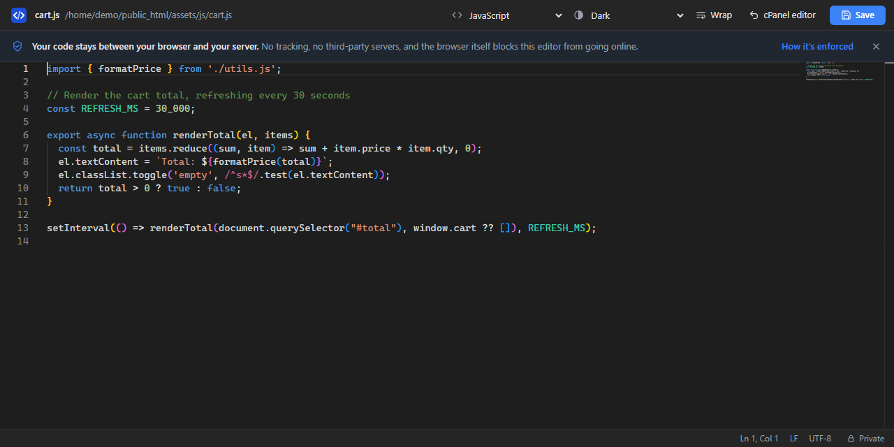
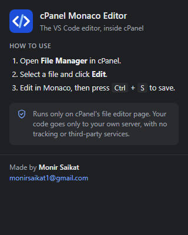

<p align="center">
  
</p>

<h1 align="center">cPanel Monaco Editor</h1>

<p align="center">
  The VS Code editor, inside cPanel's File Manager.<br>
  Made by <strong>Monir Saikat</strong> · <a href="mailto:monirsaikat1@gmail.com">monirsaikat1@gmail.com</a> · <a href="LICENSE">MIT License</a>
</p>

A Chrome extension that replaces the code editor in cPanel's File Manager with [Monaco](https://microsoft.github.io/monaco-editor/), the editor that powers VS Code.

Open any file in File Manager the way you normally do. Instead of cPanel's built-in editor, you get proper syntax highlighting, multi-cursor editing, find & replace, code folding, a minimap, and the keyboard shortcuts you already know from VS Code.



## Features

- **Real VS Code editing**: multi-cursor, bracket matching, folding, command palette (`F1`), find & replace with regex, sticky scroll.
- **Fast file explorer and tabs**: browse your account's folders in a sidebar and open several files side by side as tabs, without going back to File Manager. Folders load in parallel, and the tree you saw last time appears instantly while it refreshes in the background. Each tab has its own unsaved-changes dot and its own undo history.
- **Go to file (`Ctrl+P`)**: fuzzy-search every file in the explorer's folder by name or path. The open file's project folder is indexed first, so results appear almost immediately. Add `:42` to jump straight to line 42.
- **Find in files (`Ctrl+Shift+F`)**: search the text of every file in the explorer's folder, with match case, whole word, regular expressions and a "files to include" filter.
- **File operations**: create, rename and delete (move to trash) files and folders from the explorer's right-click menu.
- **Never lose work**: unsaved changes are kept as a draft in your browser and offered back if the page reloads, crashes or the session expires.
- **No silent overwrites**: before saving, the editor checks whether someone else changed the file on the server and shows you both versions side by side if they did.
- **Review before saving**: compare your changes with the server's version at any time.
- **Local history**: the last 20 saved versions of each file are kept in your browser for 30 days, with a side-by-side compare and one-click restore.
- **Remembers your tabs**: the files you had open come back the next time you open the editor on the same account.
- **File icons** for hundreds of file types and well-known folders, from the Material Icon Theme used in VS Code.
- **Emmet**: type `ul>li*3`, `.card`, `m10` and the like in HTML, PHP, CSS, SCSS and Less files, then press `Tab` or `Enter` to expand.
- **Automatic language detection** from the file name: PHP, JavaScript, TypeScript, HTML, CSS/SCSS/Less, JSON, Markdown, YAML, XML, SQL, Python, shell, `.htaccess`, `.env` and more. You can switch manually from the dropdown.
- **Saves straight to your server** with `Ctrl+S` / `Cmd+S`, using your existing cPanel login. The Save button shows a spinner while it works.
- **Unsaved-changes protection**: a dot on each modified tab and next to the file name, a `●` in the browser tab title, a prompt before closing a modified tab, and a browser warning if you try to leave with unsaved work in any tab.
- **12 themes plus "Match system"**: Light, Dark, GitHub Light/Dark, One Dark, Dracula, Monokai, Nord, Solarized Light/Dark, and high-contrast Light/Dark. The toolbar recolors to match, and your choice is remembered.
- **Word wrap** toggle, also remembered.
- **Transparent about privacy**: a banner and a **Private** button in the status bar explain exactly what the extension can and can't do, and how to check each claim yourself.
- **Escape hatch**: one click on **cPanel editor** brings back the original editor.
- **Fully offline**: Monaco is bundled inside the extension. Nothing is downloaded from a CDN, and your code is never sent anywhere except your own cPanel server.

## Installation

The extension isn't on the Chrome Web Store yet, so you load it manually. It takes about two minutes.

### Option A: download a release (recommended)

No Node.js or build step needed.

1. Open the [latest release](https://github.com/monirsaikat/cp-monaco/releases/latest) and download `cp-monaco-vX.Y.Z.zip`.
2. Unzip it somewhere permanent (for example `Documents/cpanel-monaco`). Chrome loads the extension from that folder every time, so don't delete it.
3. Go to `chrome://extensions`.
4. Turn on **Developer mode** (top-right toggle).
5. Click **Load unpacked** and select the unzipped folder, the one that contains `manifest.json`.

To update, download the new zip, replace the folder's contents, and click the **reload** icon on the extension's card.

### Option B: from source

You need [Node.js](https://nodejs.org/) 18 or newer.

```bash
git clone https://github.com/monirsaikat/cp-monaco.git
cd cp-monaco
npm install
```

`npm install` downloads Monaco and copies it into `extension/monaco/` automatically. Then:

1. Go to `chrome://extensions`.
2. Turn on **Developer mode**.
3. Click **Load unpacked** and select the `extension` folder inside the project.

> **Edge, Brave, Opera, Vivaldi** and other Chromium browsers work too. Use their extensions page (`edge://extensions`, `brave://extensions`, …) and follow the same steps.

## How to use it

1. Log in to cPanel and open **File Manager**.
2. Select a file and click **Edit** in the toolbar, or right-click the file and choose **Edit**.
3. If cPanel asks about the character encoding, click **Edit** again.
4. The editor opens in Monaco. Make your changes and press `Ctrl+S` (or click **Save**).

A "Saved … at …" message appears in the bottom-left corner when the file has been written to the server.

### Working with several files

The **explorer** on the left starts at your home folder, with the folder of the file you opened already expanded. Click a file to open it in a new tab, or click its tab again later to switch back. The buttons at the top of the explorer show the parent folder, refresh the listing, and open **Go to file**.

- Toggle the explorer with `Ctrl+B` or the sidebar button at the far left of the toolbar. Drag its edge to resize it.
- Close a tab with `Alt+W`, its **×**, a middle-click, or `Delete` while the tab is focused. Switch tabs with `Alt+PageUp` / `Alt+PageDown`, or jump straight to one with `Alt+1` … `Alt+9`.
- `Ctrl+P` searches files under the explorer's top folder. The first search in a session builds a list of files folder by folder, starting with the folder that holds the file you opened, which can take a few seconds on big sites. It skips folders that never hold site code (`.git`, `node_modules`, `vendor`, caches, and `mail`, `logs`, `tmp`, `ssl`, `etc` and `perl5` in your home folder) and stops after 10,000 files. If your site is bigger than that, use the explorer to show a smaller folder first.
- Images, archives, fonts and other binary files are listed but can't be opened. Files over 5 MB ask for confirmation first.
- Files opened from the explorer are read and saved as UTF-8. The file you opened from File Manager keeps the encoding cPanel reported for it.
- The tabs you had open are reopened next time (up to 12), as long as you open the editor on the same server and account.

### Creating, renaming and deleting

Right-click a file or folder in the explorer (or press `Shift+F10`) for **New file**, **New folder**, **Rename** (`F2`), **Move to trash** (`Delete`) and **Copy path**. The two buttons next to the folder name create a file or folder inside the folder you last selected.

**Move to trash** uses cPanel's trash, not permanent deletion: you can get files back from File Manager with **View Trash**. If you trash a file that's open with unsaved changes, its tab stays open, and saving creates the file again.

### Find in files

Press `Ctrl+Shift+F` (or click **Search** above the explorer) and type. Click a result to open the file with the match selected.

- **Aa**, **ab** and **.\*** toggle match case, whole word and regular expressions.
- **Files to include** takes a comma-separated list. Text like `wp-content/themes` matches anywhere in the path, and patterns like `*.php` or `inc/**/*.js` match file names.
- cPanel can't search on the server, so the first search downloads each file once (up to 1 MB each, 5,000 files) and keeps it in memory for later searches. **Refresh** in the explorer clears that cache. Open tabs are searched as you've edited them, saved or not.

### Drafts, conflicts and history

Editing live files on a server is risky, so the editor keeps a safety net:

- **Drafts.** About a second after you stop typing, unsaved changes are stored in your browser. If you come back to the file after a reload, a crash or an expired session, a bar above the editor offers to **Restore**, **Compare** or **Discard** them. A draft is removed once you save or deliberately discard it.
- **Conflict check.** Every save first re-reads the file. If it changed on the server since you opened it, nothing is written. Instead you see the server's version next to yours, and you can edit yours, **Overwrite server version**, or **Use server version** (Undo brings your text back).
- **Review.** The **Review** button compares your current text with the version on the server. You can keep editing on the right and save from there.
- **History.** Each save keeps a copy in your browser (the last 20 per file, for 30 days), plus the version from before your first edit. **History** lists them with **Compare** and **Restore**. Restoring only changes the editor, so you still have to save, and Undo reverts it.

### The extension popup

Click the extension's icon in Chrome's toolbar (pin it from the puzzle-piece menu) for a quick how-to and the version you're running.



### The toolbar

| Control | What it does |
| --- | --- |
| Sidebar button | Shows or hides the file explorer (`Ctrl+B`). |
| Language dropdown | Changes syntax highlighting for this file (doesn't modify the file). |
| Theme dropdown | Picks the editor theme. **Match system** follows your OS light/dark setting. |
| **Wrap** | Toggles word wrap. |
| **Review** | Compares your changes with the version on the server. |
| **History** | Earlier versions of this file kept in your browser, with compare and restore. |
| **cPanel editor** | Hides Monaco and shows cPanel's original editor. Reload the page to get Monaco back. |
| **Save** | Saves the file to your server. |

The status bar shows the cursor position, the file's line endings (LF/CRLF) and its character encoding. The **Private** button on the right opens a short explanation of how your code is protected. The same panel opens from the banner you see the first time, which you can dismiss with **×**.

### Keyboard shortcuts

Most VS Code shortcuts work. The most useful ones:

| Shortcut | Action |
| --- | --- |
| `Ctrl+S` | Save the current tab |
| `Ctrl+P` | Go to file (add `:line` to jump to a line) |
| `Ctrl+B` | Show/hide the explorer |
| `Alt+W` | Close the current tab |
| `Alt+PageUp` / `Alt+PageDown` | Previous / next tab |
| `Alt+1` … `Alt+9` | Go to tab 1…8, or the last tab |
| `Ctrl+Shift+F` | Find in files |
| `F2` / `Delete` | Rename / move to trash (in the explorer) |
| `F1` / `Ctrl+Shift+P` | Command palette |
| `Ctrl+F` / `Ctrl+H` | Find / Replace |
| `Ctrl+D` | Select next occurrence |
| `Alt+Click` | Add another cursor |
| `Ctrl+Alt+↑` / `↓` | Add cursor above / below |
| `Alt+↑` / `↓` | Move line up / down |
| `Shift+Alt+↑` / `↓` | Copy line up / down |
| `Ctrl+/` | Toggle comment |
| `Ctrl+Shift+[` / `]` | Fold / unfold block |
| `Shift+Alt+F` | Format document (JS, TS, JSON, HTML, CSS) |
| `Tab` / `Enter` | Expand the suggested Emmet abbreviation |
| `Alt+Z` | Toggle word wrap |
| `Ctrl+G` | Go to line |

On macOS, use `Cmd` instead of `Ctrl` and `Option` instead of `Alt`.

**Why `Alt+W` and not `Ctrl+W`?** Chrome keeps a few shortcuts for itself and never passes them to web pages or extensions: `Ctrl+W`, `Ctrl+T`, `Ctrl+N`, `Ctrl+Tab`, `Ctrl+Shift+T` and `Ctrl+PageUp/PageDown`. Pressing `Ctrl+W` therefore closes the browser tab, not the file. You get a warning first if anything is unsaved, and your open files come back next time. VS Code in the browser (vscode.dev) has the same limitation.

## Troubleshooting

**The editor says "Loading editor…" forever, or "Monaco failed to load".**
You're running from a copy of the source without its `extension/monaco/` folder. Download a [release zip](https://github.com/monirsaikat/cp-monaco/releases/latest) instead, or run `npm install` in the project first.

**The old cPanel editor still shows up.**
The extension only runs on cPanel's editor page, whose address looks like:

```
https://your-server:2083/cpsess1234567890/frontend/jupiter/filemanager/editit.html?file=…&dir=…
```

If your editor's address looks different, the extension won't activate. Email the URL to [monirsaikat1@gmail.com](mailto:monirsaikat1@gmail.com) (remove the `cpsess…` number first) so the match pattern can be extended in `extension/manifest.json`.

**"Couldn't load this file" or "Your session may have expired".**
Your cPanel login timed out. Reload the page, log in again and reopen the file.

**"Save failed: …"**
The error text comes straight from cPanel. The usual causes are file permissions, a full disk quota, or an expired session. Copy your changes somewhere safe before reloading.

**I need the original editor for one file.**
Click **cPanel editor** in the toolbar. To turn Monaco off entirely, disable the extension on `chrome://extensions`.

**Non-UTF-8 files** (e.g. legacy `ISO-8859-1` sites).
These are converted to UTF-8 for editing and back to their original encoding on save. This path has had the least testing, so keep a backup of anything important the first time you edit one.

## Privacy & security

Every claim below can be checked in the source. None of it relies on trusting us.

- **The editor is blocked from the network by the browser.** `manifest.json` gives the editor page a strict Content Security Policy (`default-src 'none'; connect-src 'none'; …`). It can only load files packaged inside the extension, and Chrome refuses any request it tries to make to a server.
- **Your files only go to your own server.** `content.js` lists, loads and saves through cPanel's own API (`Fileman::list_files`, `Fileman::get_file_content` and `Fileman::save_file_content`, plus API 2's `Fileman::mkdir` and `Fileman::fileop` for new folders, renaming and moving to trash) on the server you're already on, using the session you're already logged in with. You can confirm this in DevTools → Network.
- **No background script, no analytics, no remote code.** Monaco and Emmet are bundled inside the extension rather than loaded from a CDN.
- **No extra permissions.** The extension doesn't request access to tabs, cookies, history, downloads or storage. (Drafts and history use the standard storage every web page has, which needs no permission.)
  - Chrome's install prompt may say it can "read and change your data on all websites". That's because cPanel can run on any domain, so the match pattern can't be limited to one host. The script only activates on URLs matching `*/cpsess*/frontend/*/filemanager/editit.html*`.
- **Your theme, word-wrap and banner preferences**, and the list of open tabs, are stored locally in the browser.
- **Drafts and history stay in your browser.** Unsaved drafts and earlier versions of saved files are kept in the extension's own browser storage (IndexedDB) so you can recover them. They're never uploaded anywhere. History expires after 30 days. Keep in mind that this storage holds whatever the files contain, including secrets in files like `wp-config.php` or `.env`. You can wipe it at any time with **Delete all drafts and history now** in the **Private** panel, or by removing the extension.

No software is "100% secure", and this README won't pretend otherwise. If you find a problem, please email [monirsaikat1@gmail.com](mailto:monirsaikat1@gmail.com).

## How it works

```
cPanel editor page (editit.html)
│
├── content.js   hides cPanel's editor, reads file/dir from the URL,
│                and lists/loads/saves files via cPanel's UAPI
│
└── <iframe> editor.html   the Monaco UI (explorer, tabs, Go to file),
                           running from the extension itself, so
                           cPanel's Content Security Policy can't block it
        ▲
        └── the two talk to each other with postMessage
```

Because the extension uses cPanel's public API instead of hooking into the built-in editor's JavaScript, cPanel updates to its own editor shouldn't break it.

## Development

```
cp-monaco/
├── extension/            ← the folder Chrome loads
│   ├── manifest.json
│   ├── content.js        runs on the cPanel page; list/load/save via UAPI
│   ├── content.css       hides the original editor
│   ├── editor.html       Monaco UI (inside the iframe)
│   ├── editor.js         tabs, explorer, Go to file, themes
│   ├── editor.css
│   ├── themes.js         theme definitions (add your own here)
│   ├── popup.html/.css/.js   the toolbar popup
│   ├── icons/            logo.svg + PNG icons (16/32/48/128)
│   └── monaco/           Monaco, Emmet and file icons, copied from node_modules by npm install (git-ignored)
├── scripts/
│   └── copy-monaco.js
└── package.json
```

- After editing any file in `extension/`, click the **reload** icon on the extension's card in `chrome://extensions`, then reload the cPanel tab.
- To update Monaco, change the `monaco-editor` version in `package.json` and run `npm install`. The extension uses Monaco's AMD build (`min/vs`).
- File icons come from [`material-icon-theme`](https://github.com/material-extensions/vscode-material-icon-theme). `npm install` copies its SVGs to `extension/monaco/file-icons/` and turns its name-to-icon tables into `icons.js` (the editor's CSP doesn't allow `fetch`, even for its own files).
- Emmet comes from [`emmet-monaco-es`](https://github.com/troy351/emmet-monaco-es). Its plain-script build is copied to `extension/monaco/emmet/`, and the languages it's enabled for are set in `init()` in `editor.js`.
- To add a theme, copy one of the entries in `extension/themes.js` and change its colors. `palette` controls syntax colors and `ui` controls the toolbar around the editor.
- **Releasing.** Push a version tag and GitHub Actions builds the zip and publishes it to [Releases](https://github.com/monirsaikat/cp-monaco/releases) (`.github/workflows/release.yml`):

  ```bash
  git tag v1.0.1
  git push origin v1.0.1
  ```

  The workflow runs `npm ci`, stamps the tag's version into `manifest.json`, and attaches `cp-monaco-v1.0.1.zip` to the release. Use **Actions → Release → Run workflow** to try a build without publishing.
- To make a zip by hand, zip the `extension` folder **after** running `npm install`, so it includes `monaco/`.

## What's new

**1.1.0**
- Faster explorer: all folders on the path to your file load at once, and the previous tree is shown instantly from a local cache.
- Faster Go to file: the open file's project folder is indexed first, with more parallel requests and fewer junk folders.
- Save button shows a spinner and "Saving…" while the file is being written.
- A clear message if Monaco doesn't load, instead of an endless "Loading…".
- Releases are published as ready-to-use zips on GitHub.

## Compatibility

- **Browsers:** Chrome and other Chromium-based browsers (Manifest V3).
- **cPanel:** written for the File Manager editor in the Jupiter theme, and any theme whose editor URL matches `*/cpsess*/frontend/*/filemanager/editit.html*`.

## Author

**Monir Saikat**, [monirsaikat1@gmail.com](mailto:monirsaikat1@gmail.com)

Questions, bug reports and feature requests are welcome by email.

## License

Released under the [MIT License](LICENSE). Copyright © 2026 Monir Saikat.

In plain terms:

- ✅ You can use it for free, personally or commercially.
- ✅ You can modify it, fork it and share your own versions.
- ✅ You can include it in other projects, including paid ones.
- 📌 You must keep the copyright notice and license text in any copy you share.
- ⚠️ It comes with no warranty. Keep backups of files you care about.

This summary is just for convenience. The [LICENSE](LICENSE) file is what legally applies.

**Third-party code:** the extension bundles [Monaco Editor](https://github.com/microsoft/monaco-editor), © Microsoft Corporation, [emmet-monaco-es](https://github.com/troy351/emmet-monaco-es) and [Material Icon Theme](https://github.com/material-extensions/vscode-material-icon-theme), all MIT-licensed. Their license files are copied into `extension/monaco/` by `npm install`, so they're included automatically when you zip the extension.

## Credits

- [Monaco Editor](https://github.com/microsoft/monaco-editor) by Microsoft, MIT License.
- [emmet-monaco-es](https://github.com/troy351/emmet-monaco-es), MIT License, built on [Emmet](https://emmet.io/).
- File icons from [Material Icon Theme](https://github.com/material-extensions/vscode-material-icon-theme) by Material Extensions, MIT License.
- cPanel is a trademark of cPanel, L.L.C. This project is not affiliated with or endorsed by cPanel.
